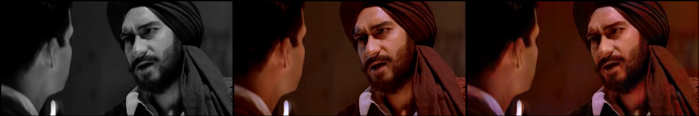

# CTC: Color The Classics

## Abstract

Colors can express emotions of the scene even without a word being spoken. This work attempts to use different deep learning techniques for automatic colorization of old black and white pictures/movies. Colorization is a one to many task in which a single channel image is converted into a 3 channel image hence it has many possible solutions. But if a model is able to understand a scene well and given proper domain knowledge there remains very few plausible solutions. We use Generative Adversarial Networks (GANs) to generate realistic color images in which two networks trying to overpower each other end up making each other better at their respective jobs. To express a scene, multiple parts of an image have to work in harmony with multiple far away parts. We tried to translate this non local harmony into our model using a Self-Attention module along with CNNs. This module solves the problem of color bleeding in many instances. We also have created our own dataset whose domain is close to the most of the old black and white movies. The current result for a black and white clip of the Pather Panchali can be found [here](https://drive.google.com/file/d/1Cq-iMX3Icy2qLamQEdUbZm6q4e1yiRI9/view?usp=sharing).

## Getting Started

### To train the model
`python train.py --dataroot /home1/btp/pkb_btp_1/data/movies/ --name colorization --netG unet_256 --batch_size 8 --use_sa_G layer_2 --use_sa_D layer_2`
### To test the model
`./scripts/test_voc_data.sh`

## Acknowledgments
The initial codebase of this repository is inspired from [
pytorch-CycleGAN-and-pix2pix](https://github.com/junyanz/pytorch-CycleGAN-and-pix2pix). The Self Attention module of our code is borrowed from [Self-Attention-GAN](https://github.com/heykeetae/Self-Attention-GAN). 

